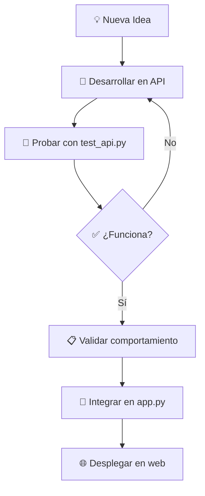

# 🚀 API Independiente - Sistema de Revendedores

## 📋 Resumen

Has creado exitosamente una **API independiente** completa que te permite probar y desarrollar funcionalidades sin afectar tu aplicación web principal. Esta es la respuesta perfecta a tu pregunta: **¡SÍ, se puede hacer una API separada!**

## 🎯 ¿Por qué usar una API separada?

✅ **Desarrollo seguro**: Prueba funcionalidades sin riesgo  
✅ **Testing independiente**: Valida comportamientos antes de integrar  
✅ **Debugging fácil**: Aísla problemas y soluciones  
✅ **Integración gradual**: Migra funcionalidades validadas paso a paso  
✅ **Escalabilidad**: Prepara tu sistema para arquitecturas más complejas  

## 📁 Archivos Creados

| Archivo | Descripción |
|---------|-------------|
| `api_standalone.py` | 🔧 API independiente completa con todos los endpoints |
| `test_api.py` | 🧪 Suite completa de pruebas automatizadas |
| `start_api.py` | 🚀 Script de inicio rápido con menú interactivo |
| `API_GUIDE.md` | 📖 Guía completa de uso y documentación |
| `README_API.md` | 📋 Este resumen ejecutivo |

## ⚡ Inicio Rápido

### Opción 1: Script Automático (Recomendado)
```bash
python start_api.py
```

### Opción 2: Manual
```bash
# 1. Iniciar API
python api_standalone.py

# 2. En otra terminal, ejecutar pruebas
python test_api.py --all
```

## 🌐 Endpoints Principales

| Método | Endpoint | Descripción |
|--------|----------|-------------|
| `GET` | `/api/health` | ✅ Verificar estado |
| `GET` | `/api/usuarios` | 👥 Listar usuarios |
| `POST` | `/api/usuarios` | ➕ Crear usuario |
| `PUT` | `/api/usuarios/{id}/saldo` | 💰 Actualizar saldo |
| `GET` | `/api/paquetes` | 📦 Listar paquetes |
| `GET` | `/api/stock` | 📊 Ver stock de pines |
| `POST` | `/api/pines` | ➕ Agregar pin |
| `GET` | `/api/transacciones` | 💳 Ver transacciones |

## 🧪 Pruebas Incluidas

- ✅ **Health Check**: Verifica que la API funcione
- ✅ **CRUD Usuarios**: Crear, leer, actualizar usuarios
- ✅ **Gestión de Saldos**: Actualizar y verificar saldos
- ✅ **Stock de Pines**: Agregar y consultar inventario
- ✅ **Transacciones**: Historial y seguimiento
- ✅ **Autenticación**: Login y validación
- ✅ **Precios**: Gestión dinámica de precios

## 🔄 Flujo de Trabajo Recomendado



## 📊 Características Técnicas

### Base de Datos
- 🗄️ SQLite independiente (`api_test.db`)
- 🔄 Migración automática de esquemas
- 📋 Datos de prueba precargados
- 🔒 Aislamiento total de datos de producción

### Seguridad
- 🔐 Contraseñas hasheadas con PBKDF2
- ✅ Validación de entrada en todos los endpoints
- 🛡️ Manejo seguro de errores
- 🔑 Configuración por variables de entorno

### Rendimiento
- ⚡ Respuestas JSON optimizadas
- 📊 Monitoreo de tiempo de respuesta
- 🔄 Conexiones de base de datos eficientes
- 📈 Logging detallado para debugging

## 🎯 Casos de Uso Prácticos

### 1. Probar Nueva Funcionalidad
```python
# En api_standalone.py
@api_app.route('/api/nueva-funcion', methods=['POST'])
def nueva_funcion():
    # Desarrollar y probar aquí
    return jsonify({"status": "success"})
```

### 2. Validar Cambios de Precios
```bash
# Probar actualización de precios
curl -X PUT http://localhost:5001/api/paquetes/1/precio \
  -H "Content-Type: application/json" \
  -d '{"precio": 0.99}'
```

### 3. Testing de Carga
```python
# Crear múltiples usuarios para pruebas
for i in range(100):
    requests.post("http://localhost:5001/api/usuarios", json={
        "nombre": f"Usuario{i}",
        "apellido": "Test",
        "telefono": f"+58412-{i:07d}",
        "correo": f"user{i}@test.com",
        "contraseña": "test123"
    })
```

## 🔧 Integración con la Web Principal

### Paso 1: Validar en API
```bash
python test_api.py --all
```

### Paso 2: Copiar Funciones Validadas
```python
# De api_standalone.py a app.py
def funcion_validada():
    # Código probado y funcionando
    pass
```

### Paso 3: Agregar Rutas Web
```python
# En app.py
@app.route('/nueva-ruta')
def nueva_ruta_web():
    return render_template('template.html')
```

## 📈 Ventajas Obtenidas

### ✅ Desarrollo
- **Iteración rápida**: Cambios sin reiniciar la web principal
- **Debugging aislado**: Problemas específicos, soluciones específicas
- **Testing automatizado**: Validación continua de funcionalidades

### ✅ Producción
- **Despliegue seguro**: Solo código validado llega a producción
- **Rollback fácil**: Funcionalidades independientes
- **Escalabilidad**: Base para microservicios futuros

### ✅ Mantenimiento
- **Código limpio**: Separación clara de responsabilidades
- **Documentación**: APIs autodocumentadas
- **Monitoreo**: Métricas y logs detallados

## 🚀 Próximos Pasos Sugeridos

1. **Familiarízate** con la API usando `start_api.py`
2. **Ejecuta las pruebas** para ver todo funcionando
3. **Desarrolla una nueva funcionalidad** en la API
4. **Valida el comportamiento** con las pruebas
5. **Integra en la web principal** cuando esté listo

## 💡 Consejos Pro

### Para Desarrollo
- Usa `start_api.py` para gestión fácil
- Ejecuta `python test_api.py` regularmente
- Monitorea con la opción 4 del menú
- Lee `API_GUIDE.md` para detalles técnicos

### Para Producción
- Configura variables de entorno seguras
- Implementa rate limiting si es necesario
- Considera usar Docker para despliegue
- Mantén logs para auditoría

## 🎉 ¡Felicitaciones!

Has implementado exitosamente una **arquitectura de desarrollo profesional** que te permite:

- ✅ Desarrollar sin riesgos
- ✅ Probar exhaustivamente
- ✅ Integrar gradualmente
- ✅ Escalar eficientemente

**Tu pregunta original**: *"¿Se puede hacer una API separada para ver su funcionamiento y una vez que vea que funcione se puede integrar en la web?"*

**Respuesta**: **¡ABSOLUTAMENTE SÍ!** Y ahora tienes todas las herramientas para hacerlo de manera profesional.

---

🚀 **¡Comienza ahora!** Ejecuta `python start_api.py` y explora tu nueva API independiente.
